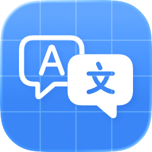

<div align="center">
  
  <h1>String Studio</h1>
  <p>
    A modern internationalization string management tool designed specifically for macOS,
    <br>
    helping Apple developers efficiently manage multilingual localization files for their applications.
  </p>

  <p>
    <strong><a href="./README.zh-CN.md">🇨🇳中文</a></strong>  | <strong>🇬🇧English</strong>
  </p>

  <p>
    <a href="https://apps.apple.com/app/id6753932371">
      
    </a>
  </p>

  <p>
    
    
    
    
  </p>
</div>

---

## 📋 Table of Contents

- [Features](#-features)
- [Screenshots](#-screenshots)
- [Installation](#-installation)
- [Usage](#-usage)
- [Technical Details](#-technical-details)
- [Requirements](#-requirements)
- [Contributing](#-contributing)
- [License](#-license)

## ✨ Features

### Core Functionality
- **📝 Intuitive Editing Interface**: Built with SwiftUI, providing a modern interface with complete editing capabilities for .xcstrings files
- **🤖 AI-Powered Translation**: Integrated AI translation service supporting batch string translation, significantly improving localization efficiency
- **🌍 Multi-language Management**: Simultaneously manage multiple language versions with support for search, filtering, and status tracking
- **👁️ Real-time Preview**: Instantly view translation progress and results to ensure localization quality

### Advanced Features
- **🎯 Translation prompts optimized specifically for Apple developers**, ensuring results comply with Apple design guidelines
- **⚙️ Support for custom AI service configuration**, flexibly adapting to different development needs
- **📊 Intelligent status management**, tracking translation status of each string (translated/untranslated/don't translate)
- **🔍 Efficient search functionality** for quickly locating strings that need editing
- **💾 Real-time saving and editing** with automatic file synchronization

## 🖼️ Screenshots


## 🚀 Installation

### From App Store

Click the download button at the top or follow these steps:
1. Open the Mac App Store
2. Search for "String Studio" or visit: [String Studio on App Store](https://apps.apple.com/app/id6753932371)
3. Click "Get" to download and install

### From Source
1. Clone this repository:
   ```bash
   git clone https://github.com/yourusername/String-Studio.git
   cd String-Studio
   ```
2. Open `String Studio.xcodeproj` in Xcode
3. Build and run the project

## 📖 Usage

### Getting Started
1. **Launch String Studio** and create a new document or open an existing `.xcstrings` file
2. **Set up your source language** - this is typically English (en) for most projects
3. **Add target languages** you want to translate to using the language sidebar

### Working with Strings

#### Managing Translations
1. **Select strings** from the main table view
2. **Edit translations** directly in the target language columns
3. **Use AI Translation** for batch processing:
   - Select multiple strings or use "Select All"
   - Click the AI translation button
   - Choose your target languages
   - Confirm to start batch translation

#### Search and Filter
- **Search bar**: Find specific strings by key or content
- **Status filter**: Filter by translation status (New, Translated, Needs Review, Don't Translate)
- **Language filter**: Focus on specific target languages

### AI Translation Setup
1. **Open Settings** (⌘,)
2. **Configure your AI service**:
   - Enter your API key
   - Choose your preferred AI provider
   - Customize translation prompts if needed
3. **Test connection** to verify your setup

## 🔧 Technical Details

### Architecture
- **Platform**: macOS (built with SwiftUI)
- **File Format**: `.xcstrings` (Apple's standard localization format)
- **Architecture Pattern**: MVVM (Model-View-ViewModel)
- **Document Management**: Uses SwiftUI's `DocumentGroup` for file handling

### Key Components

#### Data Models
- **`XCStringsDocument`**: Root structure for localization data
- **`StringEntry`**: Individual string entries with metadata
- **`Localization`**: Translation data for specific languages
- **`TranslationState`**: Enum for tracking translation status

#### Core Services
- **`AITranslationService`**: Handles AI-powered translations
- **`StringStudioDocument`**: Manages file I/O operations
- **`Defaults+Keys`**: Application settings and preferences

#### Views
- **`MainContentView`**: Main application interface
- **`TranslationView`**: String editing and translation interface
- **`LanguageSidebarView`**: Language management sidebar
- **`SettingsView`**: Application configuration

### File Format Support
String Studio works with Apple's `.xcstrings` format, which supports:
- String entries with keys and values
- Multiple language translations
- Translation states (new, translated, needs review, don't translate)
- Comments and context for translators
- Device-specific variations
- Extraction states for development workflow

## 📋 Requirements

- **macOS**: 15.0 or later

## 🤝 Contributing

We welcome contributions! Here's how you can help:

### Reporting Issues
1. Use the GitHub Issues tracker
2. Provide detailed information about the bug
3. Include steps to reproduce the issue
4. Attach screenshots if applicable

### Feature Requests
1. Open an issue with the "enhancement" label
2. Describe the feature in detail
3. Explain the use case and benefits

### Development
1. Fork the repository
2. Create a feature branch: `git checkout -b feature/your-feature-name`
3. Make your changes and test thoroughly
4. Commit your changes: `git commit -m "Add your feature"`
5. Push to the branch: `git push origin feature/your-feature-name`
6. Open a Pull Request

### Code Style
- Follow Swift naming conventions
- Use SwiftUI best practices
- Add comments for complex logic
- Include unit tests where applicable

## 📄 License

This project is licensed under the MIT License - see the [LICENSE](LICENSE) file for details.

## 🙏 Acknowledgments

- Apple for the SwiftUI framework and .xcstrings format
- The open-source community for various libraries and tools
- All beta testers and early adopters for their valuable feedback

## 📞 Support

- **Email**: [albert.abdilim@foxmail.com](mailto:albert.abdilim@foxmail.com)
- **GitHub Issues**: [Report issues here](https://github.com/yourusername/String-Studio/issues)

---

**String Studio** - Making app localization simple and efficient 🌍